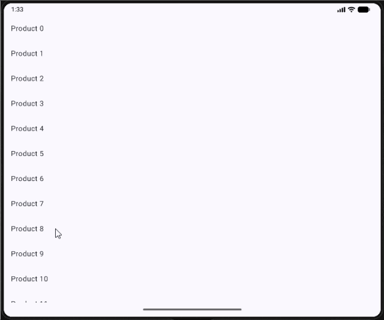

# NavDisplay函数是Navigation3的总入口，

    它主要接收3个参数，
    backStack，
    onBack
    entryProvider，我来逐个进行解释。

# backStack

backStack参数指的是导航要使用的返回栈
Navigation3将导航的返回栈都交给开发者来控制了，
因此这里需要创建一个List来管理整个App的页面导航。
Compose中创建List可以使用mutableStateListOf()函数来实现，
给这个函数传入一个ProductList参数，表示导航默认的初始页面是商品列表页。

# onBack

onBack参数实际上是一个回调，当用户触发了返回键操作时会回调到这里，
而我们就可以在这里自定义自己的返回逻辑。在不传入onBack参数的情况下，默认当用户触发了返回键操作时会自动返回到上一个页面。

-

到这里可以先暂停一下，来和Navigation 2做个对比。你会发现，当我们可以自主控制导航的返回栈之后，很多之前Navigation
2中的知识就已经用不到了。
比如说，之前讲解Navigation 2选项的时候，还教大家如何实现类似于Activity中singleTop和singleTask的导航效果。
而到了Navigation 3中，就再也没有这些知识点了，因为整个返回栈都是由我们自己控制的，
你想要实现singleTop的效果，只需要在入栈新页面的时候自己做下栈顶页面检查就可以了。Navigation
3给到了我们最大的自由度。

# entryProvider

最后一个entryProvider参数，用于定义每个页面的NavEntry。这有点类似于Navigation 2中的路由定义，
但是要更加灵活。因为Naviation 2的路由只支持字符串格式，而Navigation 3的NavEntry支持以任意类型的字段来做为key。

# / 保存和管理导航状态 /

可以看到，当我们在商品详情页面旋转手机屏幕，会自动返回到商品列表页面。
这是因为手机屏幕旋转会导致Activity重新创建，那么我们自己控制的返回栈也就跟着被清空了，因此Navigation3会显示默认的商品列表页面。
只能说凡事有利就有弊吧，在横竖屏旋转场景上，Navigation2就不会存在这个问题，因为库里已经将这些场景都考虑进去了。

- 非常容易解决
  首先，所有作为NavEntry Key的data class都必须实现NavKey接口才行。
  其次，所有作为NavEntry Key的data class都必须添加@Serializable注解，因为横竖屏旋转后的状态恢复要求数据是可序列化的才行。

# 现在你已经掌握了Navigation 3的基本用法。

到目前为止，我们学习的内容多数是和返回栈相关的。返回栈是很重要，但仍然不是Navigation 3最核心的部分。
Google这次完全重做Navigation库，最主要的原因还是过去的Navigation 2只适用于单页模式，即一屏只能显示一个路由所对应的界面。
因此，Navigation 3最核心的部分就是要解决大屏多设备适配的问题，而场景（Scene）就是专门为了解决这个问题而设计的。
在Navigation 3中，Scene是用于呈现一个或多个NavEntry实例的基本单元。
也就是说，我们可以借助Scene来实现，让屏幕中同时显示多个NavEntry页面的功能。
不过，Scene的接口定义和使用方法都相对有些复杂，我在第一次学习的时候对着那些复杂的概念术语和接口定义愣是没看明白。

# 下面就来学习一下这些工具函数是怎么使用的，其实非常简单。

NavDisplay支持传入一个sceneStrategy参数来指定我们想要的场景策略，
如果不指定的话，默认使用的就是SinglePaneSceneStrategy(即单页场景模式)。
-------------------------------------------------------------------------
前面已经说了，Navigation 2支持的就是单页模式，所以Navigation 3在默认情况下效果和Navigation 2是一样的。
-------------------------------------------------------------------------
比如，我们将刚才的程序运行到平板上，效果如下图所示。

可以看到，平板上的运行效果和手机上并没有什么区别。
这就是只支持单页模式所带来的问题，平板上明明有非常充足的空间，可是我们却没有好好利用起来，导致整个页面看起来非常空旷。
-------------------------------------------------------------------------
那么要如何解决这个问题呢？很明显，没有人愿意再去为平板单独写一份页面适配的代码。
-------------------------------------------------------------------------
这个时候就可以使用Navigation 3内置的工具函数了。刚才说了，默认的SinglePaneSceneStrategy代表单页场景模式。
除此之外，我们还可以使用ListDetailSceneStrategy，它是专门为列表详情页面这种场景设计的一种策略，
可以自动根据当前运行设备的屏幕大小来安排最合理的页面分配。
-------------------------------------------------------------------------

# ListDetailSceneStrategy // 列表详情场景模式

# SinglePaneSceneStrategy // 单页场景模式

