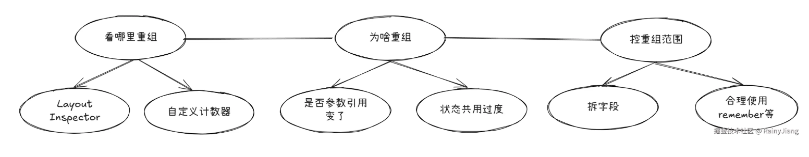

# 一. 先捋一下Compose的响应式模型

# 重组的关键：没必要重组的组件，就不要依赖需要重组的状态。隔离开，甜甜圈模型


传统View：基于命令式编程，每次数据变化后，都要手动操作 UI，例如调用 setText() 、notifyDataSetChanged()
等方法来同步界面
Compose：声明式编程，UI自动跟随状态变化（State → UI自动映射）

# 二、重组机制：藏在优雅API下的性能陷阱

官方明确说明，当状态变化时，Compose会重新执行相关代码块（重组Scope），
生成新的UI树并与旧树对比，仅更新变化部分。下面提供了些例子可以直观感受下

# 2.1 重组范围实验（直观揭秘Compose智能优化）

```kotlin
@Composable
fun CounterDemo() {
    val count = remember { mutableStateOf(0) }
    // 点击按钮触发重组
    Button(onClick = { count.value++ }) {
        // 这个Text会被重组
        Text("Increment")
    }

    // 思考下，这个Text在父组件状态变化时也会重组吗？// 答案是：不会 ,没有依赖状态，compose 会跳过非重组的组件
    Text("Unrelated Text")
}
```

---------------------------------------------------------------------------------------------------------

# 1. 频繁重组会导致性能下降

比如动画每帧更新，或者我们在 onDraw、LaunchedEffect 中频繁改变状态，
都会造成组件反复重绘，这样UI 卡顿会非常明显

```kotlin
@Composable
fun BaseAnimation() {
    var angle by remember { mutableStateOf(0f) }
    LaunchedEffect(Unit) {
        angle += 1f  // 每次加1都会触发重组
        //大概60fps
        delay(16)
    }
    Box(Modifier.rotate(angle)) {
        // 组件会每帧重组 → 性能差
    }
}
```

# 2. 重组粒度虽然智能，但也容易被破坏

比如我们把一个大块逻辑都写在一个 Composable 里，那么哪怕只改了很小一部分状态，整个函数都会被重组。

```kotlin
@Composable
fun BigComposable() {
    var count by remember { mutableStateOf(0) }
    Column {
        Text("Header")     // 不变的，但是被重组的组件包裹着，也会跟一起重组,
        Button(onClick = { count++ }) {
            Text("Click me")
        }
        Text("You clicked $count times") // 其实只有这个需要更新
    }
}
```

# 3. 错误使用状态会放大重组范围

比如我们把状态写在 Composable 外部，或者每次都用 remember但没有配合 key，
Compose 无法有效识别哪些需要保留哪些要更新。

```kotlin
//状态提到了太高的位置
var name by mutableStateOf("Alice") // 在外部定义，影响全局

@Composable
fun Greeting() {
    Text("Hello, $name")
}
```

# 4. 不必要的计算和重绘

没有使用 remember 或 derivedStateOf 去缓存计算结果，因状态更新导致整个组件或计算逻辑重复执行。

```kotlin
@Composable
fun ExpensiveComputation(count: Int) {
    val doubled = count * 2 // 每次重组都重新计算
    Text("Doubled: $doubled")
}
```

当然针对这几个坑点也挺好解决，没啥难度，更多的是一些细节，这里笔者总结了以下建议:

# 1.把状态尽量往靠近使用的组件放

# 2.多使用 remember 缓存不会变的值

# 3.用derivedStateOf派生新状态，避免无意义的重复计算

# 4.拆小composable，减少重组范围

---------------------------------------------------------------------------------------------------------

# 三、针对常见的六大状态管理陷阱与破解之道

# 陷阱1：在重组中创建状态导致数据丢失

有时候在函数里写顺手了，直接在重组中创建变量/状态，导致每次重组后都会被重置。

```kotlin
@Composable
fun BadCounter() {
    var count = 0 // 每次重组都会重置,❌ 
    var count by remember { mutableStateOf(0) }  // ✅ 正确，每次重组，都会记住这个值
    Button(onClick = { count++ }) {
        Text("Clicked $count times")
    }
}
```

这里的 count 是普通变量，只存在于当前函数执行时。每次重组，这个函数会重新执行一遍，count 也会变回 0，
导致按钮永远显示 “Clicked 0 times”。有同学说这不是小问题么，但千万不要小瞧它，千万别因小失大
正确的做法 是使用 remember 可以让Compose保持状态，在重组时自动“记住”上一次的值。

# 陷阱2：lambda中直接修改状态引发无限重组

```kotlin
@Composable
fun BadExample() {
    var flag by remember { mutableStateOf(false) }
    LaunchedEffect(flag) {
        flag = !flag // 每次都会触发重组
        // 做一些一次性的逻辑，而不是修改状态引发循环
    }
    Text("Flag is $flag")
}
```

嗯，是不是看起来好像没有太大毛病，但仔细观察会发现每次进入LaunchedEffect都会去修改状态变量flag，
从而引发重组，那重组之后又去执行LaunchedEffect，这样以来是不是进入到无限循环当中了嘛。
正确做法，笔者这里只是提供参考，就是我们不要在里面去修改状态，尽量做执行一次的逻辑，
或者确保LaunchedEffect的key是合理变化，而不是Unit

# 陷阱3：未使用remember导致状态无法持久化

有时候我们直接创建了一个状态对象，但是没有使用remember，这样会导致每次重组都会创建新的状态对象 ,
看下以下例子

```kotlin
@Composable
fun InputExample() {
    val text = mutableStateOf("") // ❌ 
    val text = remember { mutableStateOf("") }
    //或者用 var text by remember { mutableStateOf("") } 随意
    TextField(value = text.value, onValueChange = { text.value = it })
}

```

这里每次重组都会创建新的状态对象，输入框内容会被清空
正确做法就是加上remember啦，特别需要记住的是，
凡是我们希望在多次重组之间保留的状态，一定一定要使用remember

# 陷阱4：复杂对象的状态更新未使用拷贝

看到这个有同学就会问了，这是啥意思呢？别急，我们来看一个例子

```kotlin
data class User(val name: String, var age: Int)

@Composable
fun UserInfo() {
    var user by remember { mutableStateOf(User("Tom", 20)) }
    Button(onClick = {
        user.age = 21 // 错误：不会触发重组 ❌ 对象 重组，对比的是地址
        //todo 记住一点，状态更新必须要创建新的对象，这样才能触发状态引用变化
        user = user.copy(age = 21) // 正确：会触发重组 ✅ 
    }) {
        Text("Set age")
    }
    Text("Age: ${user.age}")
}

```

这里我创建了一个User对象，并且去修改User对象中age参数，会发现数据变了，
但是UI却没更新？这是因为User 是不可变对象，修改 age 并不会改变 User 引用，
Compose 认为它没变，重组就不会发生。

# 陷阱5：跨组件状态共享导致过度重组

有时候我们需要各个组件进行状态共享，这本来是一件耗时，
但如果设计不当，会让 UI大片区域“无意义重组”，导致卡顿、浪费性能，
比如说我们多个组件共同依赖一个状态对象，其中一个更新状态次数，
另一个组件中仅仅使用对象中的名字参数,但是我直接传了整个状态对象进去，
这样ComponentB 并没有使用 count，但每次 count 变，它都被重新重组，
由于uiState是一个状态对象，引用变了，全部组件都中招，
即便它们中有些组件对状态对象中另外那些变化的参数毫不关心。

```kotlin
data class UiState(val count: Int, val name: String)

@Composable
fun App() {
    var uiState by remember { mutableStateOf(UiState(0, "Compose")) }
    Column {
        // ComponentA 改变 count
        ComponentA(uiState, onUpdate = { uiState = it })
        // ComponentB 仅使用 name，但被强制重组
        ComponentB(uiState)
    }
}

@Composable
fun ComponentA(state: UiState, onUpdate: (UiState) -> Unit) {
    Button(onClick = {
        onUpdate(state.copy(count = state.count + 1))
    }) {
        Text("Count: ${state.count}")
    }
}

@Composable
fun ComponentB(state: UiState) {
    // 实际上这里只用了 name
    Text("Name: ${state.name}")
}

```

在Compose开发中，千万不要为了图省事，直接传一个状态对象进行，哪怕只用了一个字段，让所有人都陪你重组
优化的解法我们需要拆字段 + 精准传参，ComponentB只接收 name，count更新时它不会重组

```kotlin
@Composable
fun App() {
    var uiState by remember { mutableStateOf(UiState(0, "Compose")) }
    Column {
        ComponentA(uiState.count) {
            uiState = uiState.copy(count = it)
        }
        ComponentB(uiState.name)
    }
}

@Composable
fun ComponentA(count: Int, onCountChange: (Int) -> Unit) {
    Button(onClick = { onCountChange(count + 1) }) {
        Text("Count: $count")
    }
}

@Composable
fun ComponentB(name: String) {
    Text("Name: $name")
}
```
如此以来，就避免了由于错误共享导致全组件重组的陷阱。


# 陷阱6：忘记使用derivedStateOf导致无效计算
比如说我们在做一些分页筛选计算的时候，看下这个例子
```kotlin
@Composable
fun ExpensiveCalculation(count: Int) {
  val doubled = count * 2 // 每次重组都算一次
  Text("Doubled: $doubled")
}
```
这样以来是不是即使count不变，每次重组也会计算一次， 就浪费性能了，
当然这里逻辑比较简单不会有太大的性能问题，但如果计算逻辑特别复杂呢？
有没有什么方案可以解决这个问题呢? 当然有，
Compose提供了derivedStateOf派生状态，只有状态变化的时候才去重新计算。
```kotlin
@Composable
fun ExpensiveCalculation(count: Int) {
  val doubled by remember(count) { derivedStateOf { count * 2 } }
  Text("Doubled: $doubled")
}

```
只有当 count 变化时，doubled才会重新计算。
这在处理筛选、排序、大数据分页、动画变化等场景时，特别有用！

# 四、性能救赎：一些重组优化的实战方案
上文说了这么多重组陷阱的破解之道，下面我们来简单谈谈一些重组优化的方案吧，
这里我愿称之为Compose重组性能优化三板斧:

先看哪里重组（用工具Layout Inspector / 自定义计数器）
再查为啥重组（是否参数引用变了、状态共用过度等）
最后控重组范围（拆字段 + 合理使用 remember、 @Stable、 @Immutable）




